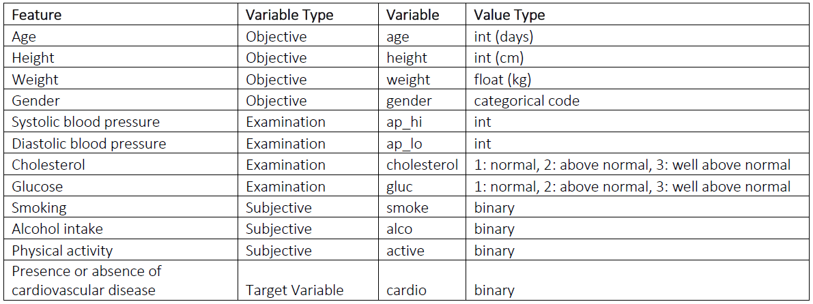

# Cardiovascular Disease Analysis

## Project Summary
Based on a report published by Centers for Disease Control and Prevention, about 610,000 people die of heart
disease in the United States every year: that is 1 in every 4 deaths. Moreover, over half of the deaths due to
heart disease in 2009 were in men. Men are usually more prone to heart diseases compared to women. In this
project, by exploring the data, we want to validate if this is true that men are more prone to heart diseases.
If so, we also want to derive what are the factors that explain heart disease better for men than women,
and vice versa. We chose Cardiovascular Disease dataset from Kaggle to go about with our research. We
assumed this dataset to be a good for our investigation because it had 70,000 records and 11 different features
obviously including gender. These features covered factual information, results from medical examination
and few survey results from patients. In our analysis we used a statistical model to predict the chance of
getting a cardiovascular disease by picking important variables from the data. The results were stunning to
show no difference in the chance of getting heart disease for male and female. Also, none of the variables had
any different impact on men and women in getting heart disease. From general intuition and from reality of
the world, we came up with the conclusion that, this data is either fake or simulated for some other purpose.
Better way to continue this research is by switching to another data which is more realistic, at the same time
acquired from an authentic source.

#### Data Description

